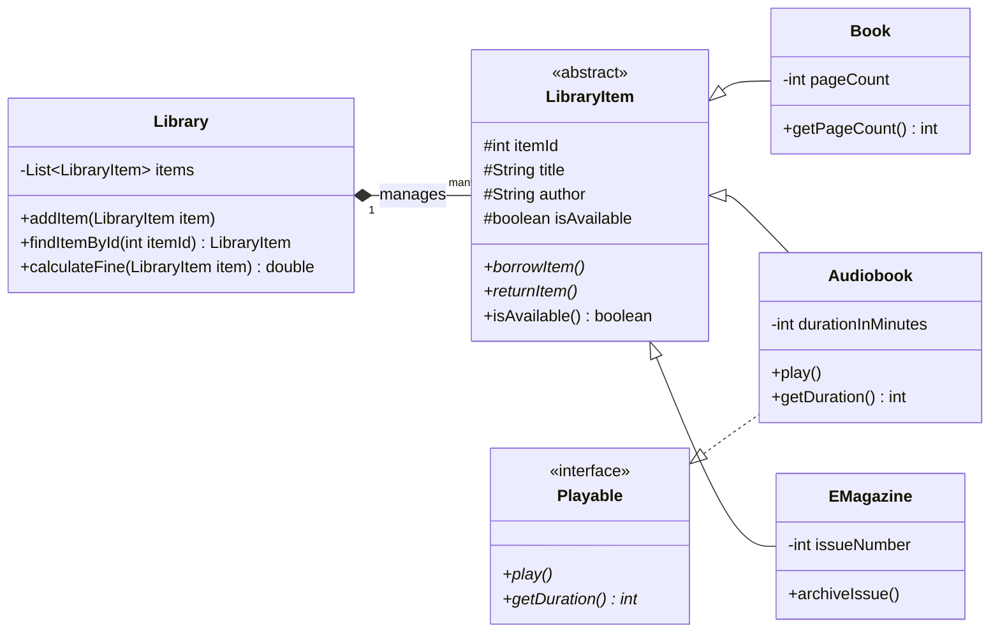

# LibraNet

```mermaid
classDiagram
    direction LR

    class LibraryItem {
        <<abstract>>
        #int itemId
        #String title
        #String author
        #boolean isAvailable
        +borrowItem()*
        +returnItem()*
        +isAvailable() boolean
    }

    class Playable {
        <<interface>>
        +play()*
        +getDuration() int*
    }

    class Book {
        -int pageCount
        +getPageCount() int
    }

    class Audiobook {
        -int durationInMinutes
        +play()
        +getDuration() int
    }

    class EMagazine {
        -int issueNumber
        +archiveIssue()
    }
    
    class Library {
        -List~LibraryItem~ items
        +addItem(LibraryItem item)
        +findItemById(int itemId) LibraryItem
        +calculateFine(LibraryItem item) double
    }

    LibraryItem <|-- Book
    LibraryItem <|-- Audiobook
    LibraryItem <|-- EMagazine
    Playable <|.. Audiobook
    
    Library "1" *-- "many" LibraryItem : manages
```
