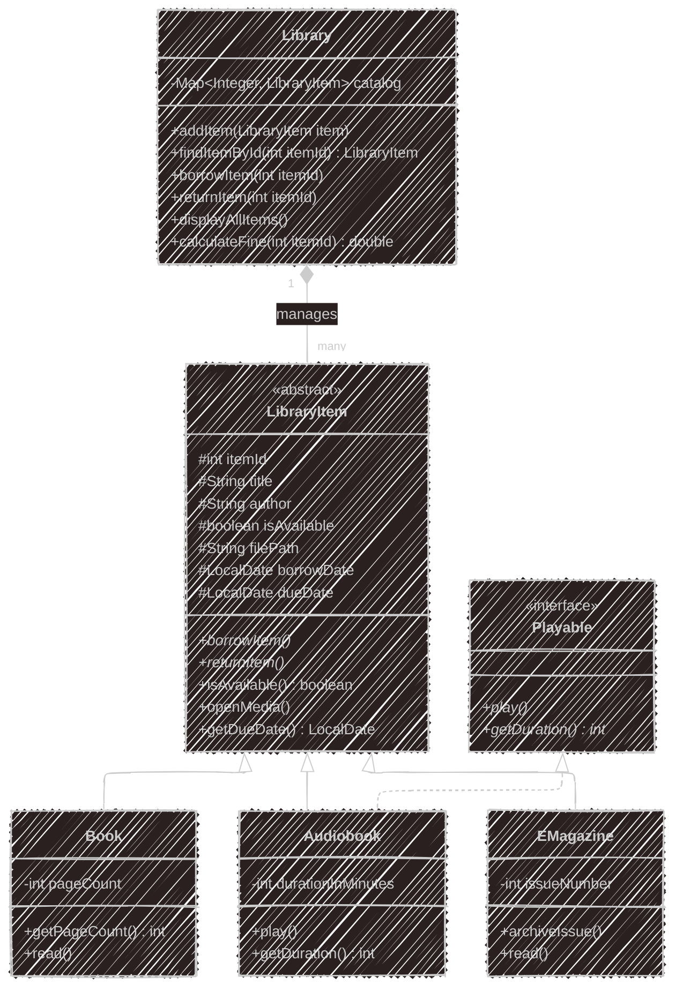

# LibraNet - A Java Library Management System

Project by [Your Name]
Date: September 19, 2025

---

## 📜 Table of Contents

- [📖 Overview](#-overview)
- [✨ Core Features](#-core-features)
- [🏗️ Project Architecture & Design Choices](#️-project-architecture--design-choices)
- [📁 Folder Structure](#-folder-structure)
- [🛠️ Technologies Used](#️-technologies-used)
- [🚀 Setup and Running the Project](#-setup-and-running-the-project)
- [🔮 Future Improvements](#-future-improvements)

---

## 📖 Overview

LibraNet is a command-line application designed to simulate the backend system for an online library platform. This project was developed as a solution to a technical challenge focused on demonstrating core Object-Oriented Programming (OOP) principles, including abstraction, inheritance, and polymorphism. The system manages various types of library items, handles core operations like borrowing and returning, and provides a robust, extensible, and reusable class structure.

---

## ✨ Core Features

- **Object-Oriented Design:** Utilizes abstract classes and interfaces to create a clean, maintainable, and extensible architecture.
- **Multiple Item Types:** Manages Books, Audiobooks, and EMagazines, each with common attributes and specialized behaviors.
- **Core Library Operations:** Supports borrowing, returning, and checking the availability of items.
- **Interactive Command-Line Interface (CLI):** A user-friendly menu allows for dynamic interaction with the library catalog.
- **File System Integration:** Can open associated media files (.pdf, .mp3) using the system's default applications.
- **Robust Error Handling:** Gracefully handles invalid user input in the CLI to prevent application crashes.
- **Unit Tested:** Core business logic is verified with a suite of JUnit 5 tests to ensure reliability and correctness.

---

## 🏗️ Project Architecture & Design Choices

The architecture is designed for reusability and future growth. The class diagram below illustrates the relationships between the core components.



- **Abstract Class: `LibraryItem`**: This is the foundation of the design. It contains all the common properties (title, itemId, etc.) and behaviors (openMedia()) shared by every item. By making it abstract, we enforce a common structure and prevent code duplication.
- **Interface: `Playable`**: This contract defines a capability that can be shared across different types of media. Currently, only `Audiobook` implements it, but in the future, a `VideoLecture` class could also implement `Playable` without any changes to the core system. This makes the design highly extensible.
- **Concrete Subclasses: `Book`, `Audiobook`, and `EMagazine`**: extend `LibraryItem` and add their own specialized properties and methods (e.g., `getPageCount()`), demonstrating inheritance.
- **Manager Class: `Library`**: This class handles the high-level management of the item catalog. By using a `Map`, it provides efficient, ID-based lookups. It acts as the main point of interaction, separating the collection logic from the item logic itself.

---

## 📁 Folder Structure

The project is organized into distinct source, test, and resource folders for clarity and maintainability.

```
LibraNet/
├── media/
│   ├── books/
│   ├── audiobooks/
│   └── emagazines/
├── src/
│   ├── LibraryItem.java
│   ├── Book.java
│   ├── Audiobook.java
│   ├── EMagazine.java
│   ├── Playable.java
│   ├── Library.java
│   └── App.java
├── test/
│   ├── LibraryTest.java
│   ├── BookTest.java
│   ├── AudiobookTest.java
│   ├── MagazineTest.java
└── README.md
```

---

## 🛠️ Technologies Used

- Java (JDK 11+)
- JUnit 5 for Unit Testing

---

## 🚀 Setup and Running the Project

### Prerequisites

- Java Development Kit (JDK 11 or newer) installed.
- Visual Studio Code with the Extension Pack for Java installed.

### 1. Running the Interactive Application (CLI)

1.  Clone this repository to your local machine.
2.  Open the project folder in Visual Studio Code.
3.  Navigate to `src/App.java` in the Explorer.
4.  Click the "Run" button that appears above the `main` method.
5.  The interactive menu will appear in the integrated terminal, ready for your commands.

### 2. Running the Unit Tests

1.  Ensure the project has been configured for testing (see JUnit setup steps).
2.  Navigate to `test/LibraryTest.java` in the Explorer.
3.  Click the green "play" icon next to the `public class LibraryTest` line to run all tests.
4.  The Test Explorer view will open and display the results. A successful run will show all tests with green checkmarks.

---

## 🔮 Future Improvements

- **User Accounts:** Add a `User` class to associate borrowed items with specific users.
- **Persistence:** Integrate a database (like SQLite) or file-based storage (like JSON) to save the library's state between sessions.
- **Search Functionality:** Enhance the `Library` class with methods to search for items by title or author, not just ID.
